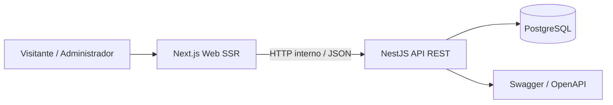

# Arquitectura técnica — CyberVestigio

## Componentes

## Responsabilidades

| Componente | Responsabilidad |
|---|---|
| Next.js Web | Renderizar la presencia corporativa, ejecutar Server Actions y proteger navegación administrativa por cookie segura. |
| NestJS API | Reglas de aplicación, validación, autenticación, gestión de contenido y contactos. |
| Prisma/PostgreSQL | Persistencia relacional y migraciones controladas. |

## SSR

Las páginas públicas usan Server Components y recuperación de datos desde NestJS con `cache: "no-store"`. Las páginas del panel administrativo se validan en servidor antes de renderizar, utilizando la cookie de sesión administrativa.

## Módulos de backend

- `auth`: inicio de sesión y emisión de JWT.
- `site`: lectura pública de configuración y servicios.
- `contacts`: recepción de formularios públicos.
- `admin`: dashboard y operaciones protegidas de administración.
- `health`: comprobación básica de disponibilidad.
- `prisma`: conexión única a PostgreSQL.
